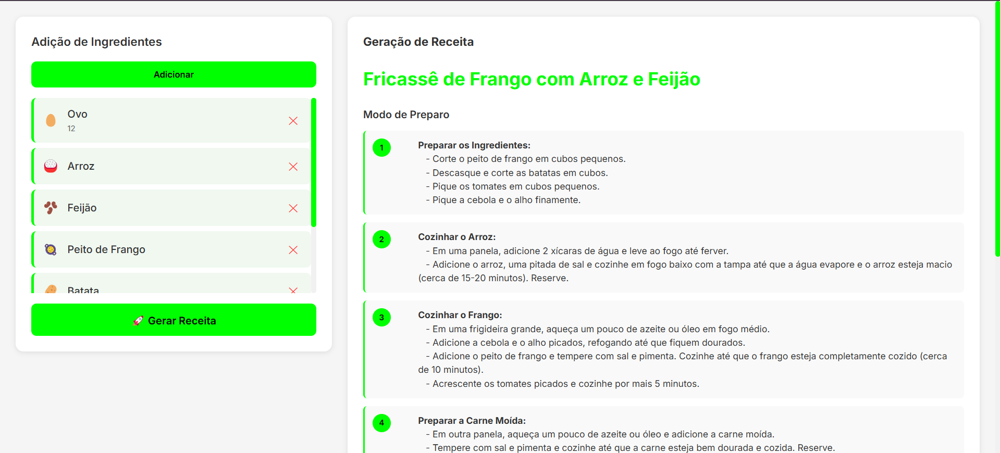
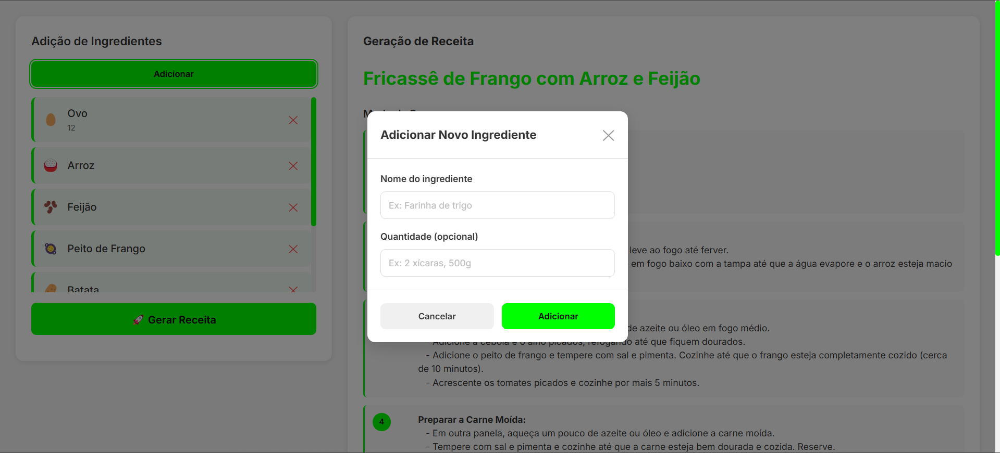

# 🍳 Receita AI - Frontend Angular

Interface web moderna e responsiva para o gerador inteligente de receitas. Desenvolvida com **Angular 19** utilizando **Standalone Components**, **Signals** e integração com API REST do backend Spring Boot.




## 📋 Sobre o Projeto

O frontend do **Receita AI** oferece uma experiência de usuário intuitiva e fluida para:
- Gerenciar ingredientes disponíveis na despensa
- Gerar receitas personalizadas usando IA
- Visualizar receitas estruturadas com instruções detalhadas
- Interface responsiva e moderna

## ✨ Principais Funcionalidades

✅ **Gerenciamento de Ingredientes**
- Adicionar ingredientes com nome e quantidade
- Visualizar lista de ingredientes com ícones
- Remover ingredientes da despensa
- Sincronização automática com o backend

✅ **Geração de Receitas com IA**
- Geração automática baseada nos ingredientes cadastrados
- Visualização de receitas estruturadas
- Instruções de preparo numeradas e formatadas
- Feedback visual durante o processamento

✅ **Interface Moderna**
- Design clean e minimalista
- Animações suaves e transições
- Indicadores de loading
- Modais interativos
- Scrollbar customizado

## 🏗️ Arquitetura

O projeto segue os padrões mais modernos do Angular 19:

```
src/app/
│
├── components/                           # Componentes da aplicação
│   ├── main-container/                   # Container principal
│   │   ├── main-container.ts             # Lógica do container
│   │   ├── main-container.html           # Template
│   │   └── main-container.scss           # Estilos
│   │
│   ├── ingredient-list/                  # Lista de ingredientes
│   │   ├── ingredient-list.ts            # Gerenciamento de ingredientes
│   │   ├── ingredient-list.html          # Template da lista
│   │   └── ingredient-list.scss          # Estilos
│   │
│   ├── add-ingredient-modal/             # Modal de adição
│   │   ├── add-ingredient-modal.ts       # Lógica do modal
│   │   ├── add-ingredient-modal.html     # Template do modal
│   │   └── add-ingredient-modal.scss     # Estilos
│   │
│   └── recipe-generator/                 # Exibição de receitas
│       ├── recipe-generator.ts           # Lógica de exibição
│       ├── recipe-generator.html         # Template da receita
│       └── recipe-generator.scss         # Estilos
│
├── models/                               # Interfaces TypeScript
│   ├── item.model.ts                     # Modelo de ingrediente
│   └── recipe.model.ts                   # Modelo de receita
│
├── services/                             # Serviços da aplicação
│   └── recipe.ts                         # Service HTTP para API
│
├── shared/                               # Componentes compartilhados
│   └── layout/                           # Layout components (footer, header, etc)
│
└── environments/                         # Configurações de ambiente
    ├── environment.ts                    # Produção
    └── environment.development.ts        # Desenvolvimento
```

## 🚀 Tecnologias Utilizadas

### Core
- **Angular 19** - Framework principal
- **TypeScript 5.7+** - Linguagem
- **RxJS 7.8+** - Programação reativa

### Recursos Angular Modernos
- **Standalone Components** - Arquitetura modular sem NgModules
- **Signals** - Sistema de reatividade nativo
- **New Control Flow** - @if, @for, @else syntax
- **HttpClient** - Comunicação HTTP
- **FormsModule** - Formulários

### Estilização
- **SCSS** - Pré-processador CSS
- **CSS Grid & Flexbox** - Layout responsivo
- **CSS Animations** - Animações customizadas
- **Google Fonts (Inter)** - Tipografia moderna


### Fluxo de Teste

1. **Adicionar Ingredientes**:
   - Clique em "Adicionar"
   - Digite nome e quantidade
   - Confirme

2. **Gerar Receita**:
   - Clique em "🚀 Gerar Receita"
   - Aguarde o processamento da IA
   - Visualize a receita gerada

3. **Gerenciar Ingredientes**:
   - Remova ingredientes clicando no ✕
   - Adicione mais ingredientes conforme necessário

## 📱 Design Responsivo

O layout se adapta automaticamente:

- **Desktop (>1024px)**: Grid 2 colunas (lista | receita)
- **Tablet (768px-1024px)**: Grid 1 coluna empilhada
- **Mobile (<768px)**: Layout vertical otimizado

## 🔒 Boas Práticas Implementadas

✅ **Standalone Components**: Arquitetura moderna sem NgModules  
✅ **Signals**: Sistema reativo nativo do Angular  
✅ **Tipagem Forte**: TypeScript com interfaces bem definidas  
✅ **Separação de Responsabilidades**: Components + Services  
✅ **Programação Reativa**: RxJS Observables  
✅ **Error Handling**: Tratamento de erros HTTP  
✅ **Loading States**: Feedback visual para operações assíncronas  
✅ **Environment Configuration**: Configuração por ambiente  
✅ **SCSS Modular**: Estilos componentizados  
✅ **Animações Suaves**: UX aprimorada  

## 🚀 Melhorias Futuras

- [ ] Adicionar autenticação e autorização
- [ ] Criar temas (dark mode)
- [ ] Implementar lazy loading de rotas
- [ ] Adicionar validação avançada de formulários
- [ ] Criar sistema de notificações toast
- [ ] Implementar filtros e busca de receitas
- [ ] Adicionar suporte para imagens de receitas
- [ ] Criar histórico de receitas geradas
- [ ] Implementar favoritos

```
⭐ **Se este projeto foi útil para você, considere dar uma estrela no repositório!**
```


